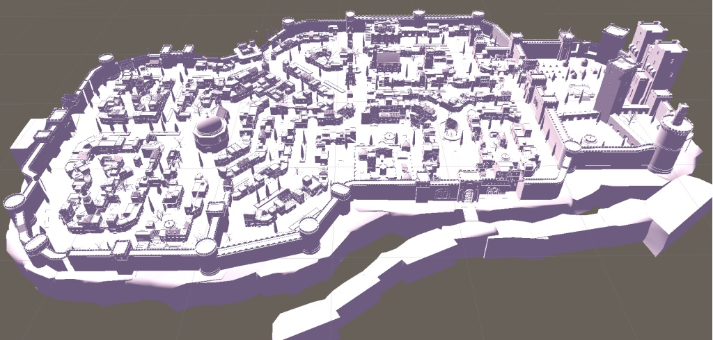
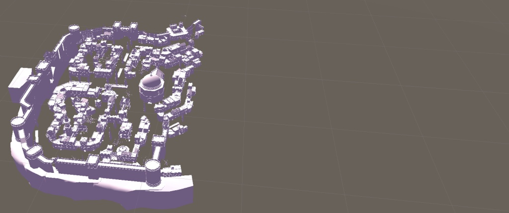
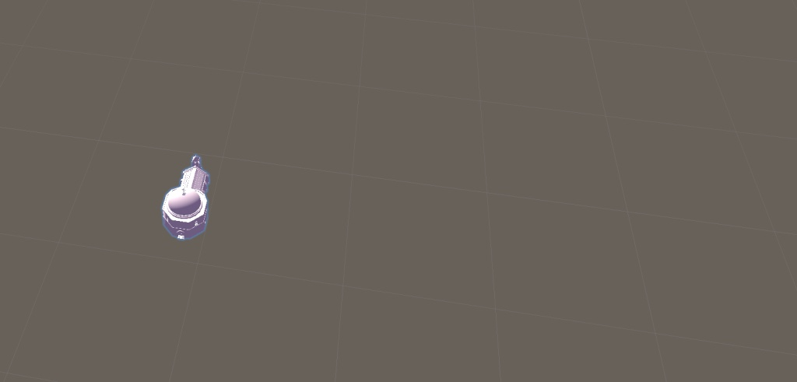


# ExportSceneToObj

一款用于导出场景（包括`GameObject`和`Terrian`）或到`.fbx`模型`.obj`文件的`Unity`插件。

## 功能

* 支持导出物件和地形
* 支持自定义裁剪区域
* 支持自动裁剪功能
* 支持单个选择导出
* 支持导出`.fbx`模型

## 截图






## 用法

* 通过下载源码或`unitypackage`包导入到你的项目中（放在`Assets`目录下）。如果你是`2018.3`及以上版本，强烈建议通过`Package Manager`的`Git`来导入包（也可以下载后本地安装包）：

  1. 打开`Packages`目录下的`manifest.json`文件，在`dependencies`下加入：
  ``` json
     "com.monitor1394.exportscenetoobj": "https://github.com/monitor1394/ExportSceneToObj.git",
  ```
  2. 回到`Unity`，可能会花1分钟左右进行下载和编译，成功后就可以开始使用了。
  3. 如果要删除`ExportSceneToObj`，删除掉1步骤所加的内容即可。
  4. 如果要更新`ExportSceneToObj`，删除`manifest.json`文件的`lock`下的`com.monitor1394.exportscenetoobj`相关内容即会从新下载编译。

* 如果要自定义裁剪区域的话，场景中增加空`GameObject`用于表示裁剪区域（需要左下角和右上角两个空`GameObject`），并修改代码中`CUT_LB_OBJ_PATH`和`CUT_RT_OBJ_PATH`为对应的路径
* 在`Unity`的菜单栏上有`ExportScene`菜单即可
* 怎么单独导出`.fbx`模型？
    1. 将`.fbx`拖到场景中
    2. 在`Hierarchy`试图中选中`fbx`的`GameObject`，右键执行`ExportScene` --> `ExportSelectedObj`单独导出即可

## 其他

1. 目前判断物件是否在裁剪区域只是判断物件的坐标是否在区域内，还没有实现物件边界裁剪。
2. 只有包含`MeshFilter`、`SkinnedMeshRenderer`、`Terrian`的物件才会被导出。

## 问题

1. 为什么将脚本放入项目中后菜单栏还是看不到`ExportScene`菜单项？  
   答：脚本文件放到正确的目录，同时要检查是否有其他脚本有报错没有编译通过，有报错时先要处理报错。  

2. 为什么导出的`obj`文件在`Maya`等`3D`软件中显示正常,但在`3d Max`显示异常？  
   答：`3d Max`导入设置中勾选`Import as single mesh`选项。  

## 觉得有用的朋友帮忙点个star吧

## 参考

1. [ExportOBJ](http://wiki.unity3d.com/index.php?title=ExportOBJ)
2. [TerrainObjExporter](http://wiki.unity3d.com/index.php?title=TerrainObjExporter)
